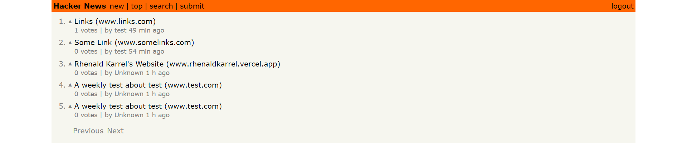
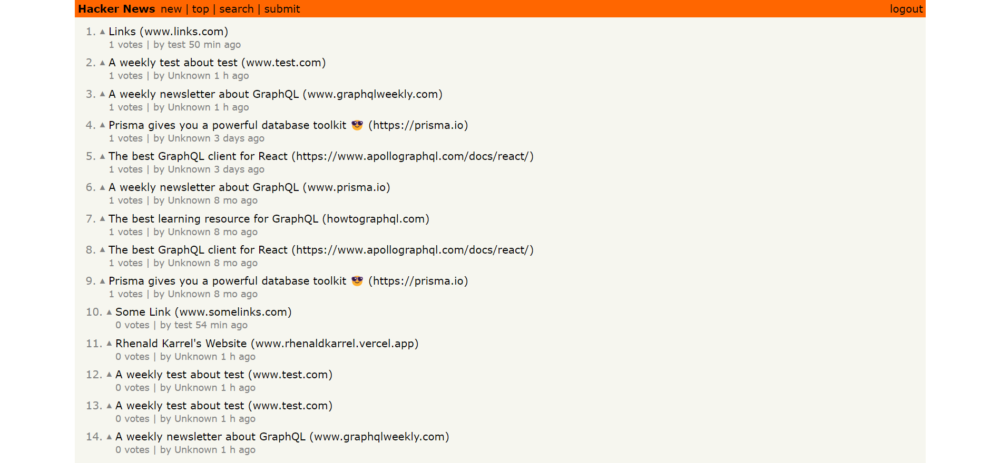

# Hackernews Clone

This is a Hackernews Clone project that I have created by following the [How to GraphQL](https://github.com/howtographql) tutorial. **This repository focuses on implementing the frontend side using my personal code standard and workspace setup**. For backend implementation, you can visit this [repository](https://github.com/howtographql/graphql-js) of Node.js GraphQL Server implementation by [How to GraphQL](https://github.com/howtographql).

This app contains 5 core functionalities:

1. **new**: see all links that are posted
2. **top**: see all links sorted by most upvoted by users
3. **submit**: create new links (for authorized users)
4. **search**: search list of links
5. **login/logout**: login, signup, and logout




## Technology Used

- React.js
- GraphQL Apollo Client
- Eslint + Prettier
- Husky
- PropTypes

## Feature Highlights

- Simple query (reading links) and mutation (creating links)
- Search the list of links (filtering by keyword inputted)
- Authentication with GraphQL
- Caching with GraphQL
- Simple pagination with GraphQL
- Realtime updates with GraphQL subscriptions

## How to use

### 1. Clone repository

```sh
git clone https://github.com/rhenaldkarrel/hackernews-react-apollo
```

### 2. Start the backend server

Go to the `server` folder, install dependencies and start the server.

```sh
cd hackernews-react-apollo/server
yarn
yarn dev
```

> **Note**: If you want to interact with the GraphQL API of the server inside a [GraphQL Playground](https://github.com/prisma/graphql-playground), you can navigate to [http://localhost:4000](http://localhost:4000).

### 3. Run the app

Now that the server is running, you can start the React app as well. The commands need to be run in a new terminal tab/window inside the root directory `hackernews-react-apollo` (because the current tab is blocked by the process running the server):

```sh
yarn
yarn start
```

You can now open your browser and use the app on [http://localhost:3000](http://localhost:3000).
